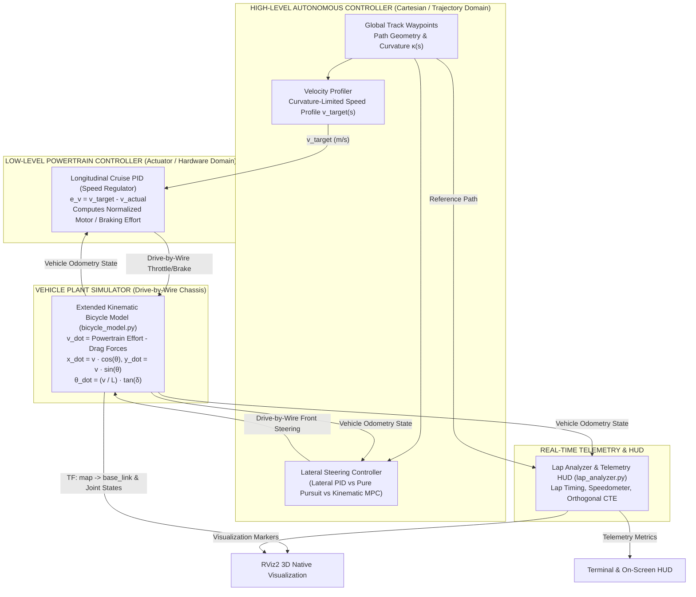
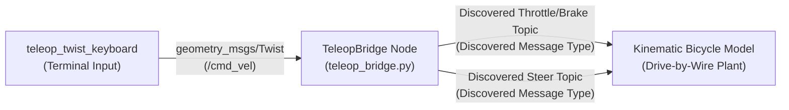
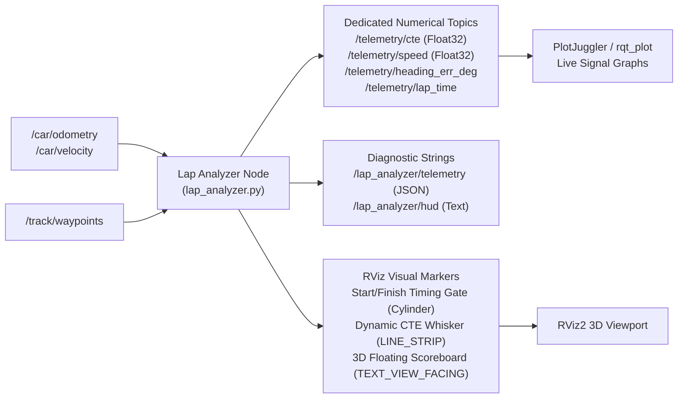

# Autonomous Vehicle Control Track — Hands-On Assignment Guide

**Autotronics Research Lab (ARL) — Ain Shams University**  
*Course: Autonomous Vehicles & Drive-by-Wire Systems*  
*Target Platform: ROS 2 Humble | Python 3.10 | Extended Kinematic Bicycle Simulator*  
*Format: Individual Student Project*

---

## Welcome to the Control Track! 🚗💨

Welcome to the **ARL Autonomous Vehicle Control Track**! In this hands-on project, you will build, tune, and evaluate the core control stack used in modern autonomous vehicles—from autonomous racing platforms (such as F1TENTH and Indy Autonomous Challenge) to automated guided vehicles (AGVs) and commercial autonomous driving systems (such as Autoware and Apollo).

Control engineering is the bridge between high-level path planning and low-level physical actuation. A planner can produce a mathematically smooth trajectory, but without a robust controller that accounts for vehicle kinematics, actuator limits, and powertrain drag dynamics, the vehicle will fail to track the path.

### 🏎️ Vehicle Physics Model: Extended Kinematic Bicycle Model
Unlike simplified academic simulations where the vehicle instantly commands forward velocity as a direct input ($u = [v, \delta]^T$), this project implements an **Extended Kinematic Bicycle Model** (4-DOF: $x, y, \theta, v$) with Drive-by-Wire powertrain dynamics:
- **Continuous 4-State Vector**: $\mathbf{x} = [x, y, \theta, v]^T \in \mathbb{R}^4$, where longitudinal speed $v$ is an explicit dynamic state variable with momentum and inertia.
- **2-Input Control Vector**: $\mathbf{u} = [u_{\text{throttle}}, \delta]^T \in \mathbb{R}^2$, driven by normalized powertrain throttle/braking effort $u_{\text{throttle}} \in [-1.0, 1.0]$ and front steering angle $\delta \in [-\delta_{\text{max}}, \delta_{\text{max}}]$.
- **Physical Resistance**: Accounts for motor drive acceleration, mechanical braking, rolling resistance ($c_{\text{roll}} v$), and speed-squared aerodynamic drag ($c_{\text{drag}} v^2$):
  $$\dot{v} = k_a \cdot u_{\text{throttle}} - (c_{\text{drag}} v^2 + c_{\text{roll}} v)$$

Because of this physical powertrain lag and speed-dependent drag, you cannot simply assume the car moves at $v_{\text{target}}$—you must engineer a **two-tier control stack** combining low-level longitudinal cruise regulation with high-level geometric/optimal lateral steering.

### ⏱️ Performance Analysis & Telemetry: `lap_analyzer.py`
In professional motorsport and autonomous vehicle development, observability is just as critical as actuation. This project features a dedicated referee and telemetry module: **`lap_analyzer.py`** (located in `src/track_environment/track_environment/lap_analyzer.py`).
- **Real-Time Error Computation**: Continuously calculates signed orthogonal cross-track error (CTE) and heading alignment error relative to the racetrack waypoints.
- **Dedicated Plottable Topics**: Publishes real-time signals as individual `std_msgs/msg/Float32` topics (`/telemetry/cte`, `/telemetry/speed`, `/telemetry/heading_err_deg`, `/telemetry/lap_time`) designed for instant graphing in PlotJuggler and `rqt_plot`.
- **3D RViz Dashboard**: Renders visual markers including the Start/Finish timing gate, dynamic CTE whisker lines, and floating 3D text HUD scoreboards over the car.
- **Benchmarking Benchmark Table**: When crossing the start/finish gate, `lap_analyzer.py` logs lap times, top speed, Mean CTE, Max CTE, and RMS CTE—the exact data required to complete your final **Milestone 7 Deliverable**!

### Journey Overview

This project is structured into an **incremental journey** designed to build your physical intuition and robotics engineering skills step by step:

```mermaid
flowchart LR
    M1["1. Discovery<br/>(Inspect Graph via CLI)"] --> M2["2. Plant Kinematics<br/>(ODE & Euler Integration)"]
    M2 --> M3["3. Teleoperation<br/>(Open-Loop Driving)"]
    M3 --> M4["4. Longitudinal Cruise PID<br/>(Powertrain Regulation)"]
    M4 --> M5["5. Autonomous Tracking<br/>(Velocity Profile & Steer)"]
    M5 --> M55["5.5 Telemetry & Dashboard<br/>(lap_analyzer.py & Plots)"]
    M55 --> M6["6. Free Exploration<br/>(Ackermann / 3D Sim / MPPI)"]
    M6 --> M7["7. Final Report<br/>(README.md & Metrics)"]
    M7 --> M8["8. Video Walkthrough<br/>(3-5 min Demo)"]
```



1. **Milestone 1 — Discovery: Inspecting the ROS 2 Computation Graph**: Launch the environment, discover topic interfaces using ROS 2 CLI tools, and set up graphical plotting with `rqt_plot` and PlotJuggler.
2. **Milestone 2 — Vehicle Kinematics & Powertrain Resistance**: Implement the continuous equations of motion and numerical integration for a 4-state Extended Kinematic Bicycle Model actuated via powertrain throttle/acceleration and front steering. Verify via direct CLI actuation commands.
3. **Milestone 3 — Interactive Teleoperation Node**: Build a bridge node translating standard `/cmd_vel` inputs into drive-by-wire signals, and take the vehicle for a manual test drive with raw throttle.
4. **Milestone 4 — Low-Level Powertrain Cruise Control (Longitudinal PID)**: Implement a closed-loop speed regulator with anti-windup. Upgrade your teleoperation bridge with cruise control to experience the driveability difference firsthand.
5. **Milestone 5 — Autonomous Path Tracking: It's Time to Get the Car to Drive Autonomously!**:
   - **5.1 High-Level Velocity Profiler & Path Curvature**: First, get the car to determine what velocity to drive at based on track curvature $\kappa(s)$.
   - **5.2 Steer Using Reactive Feedback (Lateral PID)**: Implement reactive error feedback and observe why it struggles at racing speeds.
   - **5.3 Steer Using Geometric Preview (Pure Pursuit)**: Implement forward lookahead arc preview to eliminate corner apex overshoot.
   - **5.4 Steer Using Constrained Optimal Preview (Extended Kinematic MPC)**: Formulate and solve multi-step constrained receding horizon optimization with acceleration and steering inputs.
   - **5.5 Real-Time Telemetry, Graphing & RViz Dashboard Engineering**: Engineer lap timing, cross-track error statistics, individual plottable telemetry topics, and 3D RViz markers (CTE whisker and floating HUD) in `lap_analyzer.py`.
6. **Milestone 6 — Free Exploration & Reference Resources**: Connect to industrial autonomous vehicle systems through curated resources on 4-wheel Ackermann kinematics, 3D physics simulation (Gazebo & MVSim), and stochastic path tracking (Nav2 MPPI).
7. **Milestone 7 — Deliverable 1: Repository Documentation (`README.md`)**: Benchmark your controllers across all modes, log performance telemetry, and answer key theoretical questions.
8. **Milestone 8 — Deliverable 2: Video Walkthrough**: Record a 3–5 minute video demonstrating your code and running controllers in simulation.

---

## System Architecture: The Two-Tier Paradigm

Modern autonomous vehicle control stacks enforce a strict **separation of concerns** between high-level path tracking and low-level powertrain regulation:



### Why Two Tiers?
- **High-Level Autonomy**: Operates in geometric space (meters, radians). It answers: *"Given the reference path curvature and current vehicle pose, what steering angle $\delta$ and what target speed $v_{target}$ should the vehicle have?"*
- **Low-Level Powertrain Control**: Operates in the hardware / actuator domain. In physical vehicles, motors do not take instantaneous speed commands; they accept PWM duty cycle, current, or throttle percentage. Furthermore, aerodynamic drag ($F_{drag} \propto v^2$) and rolling friction actively oppose motion. The longitudinal speed regulator ensures the vehicle reaches and maintains $v_{target}$ regardless of speed-dependent resistance.

---

## Milestone 1: Discovery — Inspecting the ROS 2 Computation Graph

In professional robotics engineering, you will rarely receive a complete document listing every topic name. Instead, you inspect the live system using ROS 2 command-line interface (CLI) tools.

### 1.1 Build and Launch the Base Simulation
Open a terminal, source ROS 2 Humble, build the workspace, and launch the base simulation:

```bash
# Source ROS 2 Humble
source /opt/ros/humble/setup.bash

# Ensure required Python dependencies are installed (including SciPy for MPC)
sudo apt update && sudo apt install -y python3-scipy python3-numpy

# Build the workspace (bicycle_sim, bicycle_control, track_environment)
cd ~/Projects/content/ARL\ Sessions\ -\ Control/contorl_task
colcon build --symlink-install
source install/setup.bash

# Launch the standalone simulation (no autonomous controller)
ros2 launch bicycle_sim bicycle_sim.launch.py
```

An RViz2 window will open displaying the racetrack, boundaries, and a 3D car model at the start/finish position.

> [!NOTE]
> The vehicle is currently stationary. Even if you try to publish commands to it right now, **it will not move** because the underlying equations of motion in `bicycle_model.py` are not yet implemented! You will bring the car to life in Milestone 2.

### 1.2 Discover the Topic Interfaces via CLI
In a second terminal, investigate the active computation graph:

```bash
source /opt/ros/humble/setup.bash

# 1. List all active topics in the system
ros2 topic list

# 2. Inspect the publishers and subscribers for individual topics
ros2 topic info <topic_name>

# 3. Check the message type definition for each topic
ros2 interface show <message_type_name>
```

#### Discovery Questions to Answer:
1. Which topic publishes the vehicle's position, heading, and forward velocity? What is its message type?
2. Which topic is subscribed to by the vehicle to accept front wheel steering angle? What units does it expect?
3. Which topic is subscribed to by the vehicle to accept powertrain acceleration/braking commands? What is its numerical range?
4. Which topic publishes the reference path waypoints?
5. Which node publishes live telemetry signals (`/telemetry/cte`, `/telemetry/speed`) and RViz visual markers (`/track/lap_markers`)? Which Python script implements this node? (Inspect `src/track_environment/track_environment/lap_analyzer.py`).

Keep note of these topic names—you will use them throughout the remainder of this assignment.

### 1.3 Visualizing and Graphing Signals (`rqt_plot` & PlotJuggler)
In control systems engineering, looking at numbers scrolling past in a terminal is not enough. You need to inspect dynamic time-series signals—such as step responses, speed tracking overshoot, and cross-track error oscillations—in real time.

ROS 2 provides two primary graphical plotting tools:

#### 1. Installing Plotting Tools
Install `rqt_plot` and `PlotJuggler` (a high-performance time-series visualization tool widely used in autonomous vehicle development):

```bash
# Install rqt_plot and PlotJuggler with ROS 2 plugins
sudo apt update && sudo apt install -y ros-humble-plotjuggler-ros rqt-plot
```

#### 2. Using `rqt_plot` (Lightweight Quick-Check)
`rqt_plot` allows you to quickly plot numerical topics (e.g., `std_msgs/msg/Float32` or numerical fields in standard messages):

```bash
# Plot forward velocity and cross-track error in real time
ros2 run rqt_plot rqt_plot /telemetry/cte /telemetry/speed
```

#### 3. Using PlotJuggler (Advanced Multi-Topic Engineering Workbench)
PlotJuggler provides zooming, streaming curves, derivative calculation, layout saving, and multi-axis plotting:

```bash
# Launch PlotJuggler
ros2 run plotjuggler plotjuggler
```

> [!TIP]
> In PlotJuggler, click **Streaming > Start: ROS2 Topic Re-Publisher**, select the topics you want to monitor (e.g., `/telemetry/cte`, `/telemetry/speed`, `/car/velocity`), and drag-and-drop signals onto the graph canvas. You will use these plots throughout Milestones 4 and 5 to tune your controllers and diagnose oscillations!

---

## Milestone 2: Vehicle Kinematics & Powertrain Resistance

In this milestone, you will implement the mathematical physics engine simulating the vehicle plant in `src/bicycle_sim/bicycle_sim/bicycle_model.py`.

### 2.1 The Extended Kinematic Bicycle Model
At moderate accelerations (where tire slip is negligible), 4-wheel vehicles are accurately represented by the bicycle approximation, which collapses the two front wheels into a single virtual steerable wheel, and the two rear wheels into a single virtual drive wheel at the rear axle center.

#### Basic vs. Extended Kinematic Bicycle Models:
- In the **basic 3-state kinematic bicycle model**, longitudinal velocity $v$ is assumed to be an instantaneous direct input ($u = [v, \delta]^T$), ignoring powertrain lag, vehicle inertia, motor torque limits, and aerodynamic drag.
- In this project, we implement an **Extended Kinematic Bicycle Model** (also known as an acceleration-actuated or 4-state kinematic bicycle model). Here, longitudinal velocity $v$ is an explicit dynamic state variable, and the vehicle is actuated via **normalized powertrain throttle/braking effort** $u_{throttle} \in [-1.0, 1.0]$ and front steering angle $\delta$.

The 4-dimensional state vector $\mathbf{x}$ and 2-dimensional control input vector $\mathbf{u}$ are:

$$\mathbf{x} = \begin{bmatrix} x \\ y \\ \theta \\ v \end{bmatrix} \in \mathbb{R}^4, \quad \mathbf{u} = \begin{bmatrix} u_{throttle} \\ \delta \end{bmatrix} \in \mathbb{R}^2$$

- $x, y$: Global Cartesian coordinates of the rear axle center (meters).
- $\theta$: Vehicle heading angle / yaw (radians), where $0\text{ rad}$ points along $+x$.
- $v$: Forward longitudinal velocity along the car body (m/s).
- $u_{throttle}$: Normalized powertrain motor / braking command in $[-1.0, 1.0]$.
- $\delta$: Front wheel steering angle in **radians**, bounded by $[-\delta_{max}, \delta_{max}] = [-0.6109, 0.6109]\text{ rad}$ ($\pm 35^\circ$).

### 2.2 Continuous Equations of Motion ($\dot{\mathbf{x}} = f(\mathbf{x}, \mathbf{u})$)
The continuous state derivatives are:

$$\dot{x} = v \cos\theta$$

$$\dot{y} = v \sin\theta$$

$$\dot{\theta} = \frac{v}{L} \tan\delta$$

$$\dot{v} = k_a \cdot u_{throttle} - \left(c_{drag} v^2 + c_{roll} v\right)$$

#### Physical Parameter Values:
- Wheelbase length: $L = 0.3302\text{ m}$ ($13\text{ inches}$)
- Powertrain acceleration scaling: $k_a = 4.0\text{ m/s}^2$
- Aerodynamic drag coefficient: $c_{drag} = 0.005$
- Rolling resistance coefficient: $c_{roll} = 0.05$

> [!IMPORTANT]
> ### 🛑 Powertrain Propulsion vs Braking Behavior
> In this drive-by-wire system:
> - When $u_{throttle} \ge 0$: $k_a \cdot u_{throttle}$ produces positive motor torque, accelerating the vehicle forward against aerodynamic drag ($c_{drag} v^2$) and rolling resistance ($c_{roll} v$).
> - When $u_{throttle} < 0$: $u_{throttle}$ represents mechanical braking effort. Because $u_{throttle} < 0$, $k_a \cdot u_{throttle}$ contributes a negative acceleration (deceleration) term, acting together with drag and rolling resistance to rapidly slow the vehicle down.
> - **The vehicle does NOT move in reverse**: In discrete integration, velocity is clamped to $v_{k+1} \ge 0.0\text{ m/s}$. Braking brings the vehicle to rest and holds it at a standstill. Holding negative throttle will not reverse the car.

### 2.3 Numerical Forward Euler Integration
The simulation operates at discrete intervals $\Delta t = 0.1\text{ s}$ ($10\text{ Hz}$). The state is integrated forward:

$$\mathbf{x}_{k+1} = \mathbf{x}_k + \dot{\mathbf{x}}_k \Delta t$$

#### Essential Integration Constraints:
1. **Heading Normalization**: Heading angles must remain wrapped to $[-\pi, \pi)$:
   $$\theta_{wrapped} = \text{atan2}(\sin\theta, \cos\theta)$$
2. **Speed Clamping**: Enforce non-negative forward speed and top speed ceiling:
   $$v_{k+1} = \max\left(0.0, \min\left(v_{k+1}, v_{max}\right)\right)$$

### 2.4 Implementation in `bicycle_model.py`
Open `src/bicycle_sim/bicycle_sim/bicycle_model.py` and implement:
- `update_x_dot()`: Calculates $\dot{\mathbf{x}} = [\dot{x}, \dot{y}, \dot{\theta}, \dot{v}]^T$.
- `update_x()`: Performs Forward Euler integration, wraps heading, and clamps velocity.

### 2.5 Verification via Direct CLI Actuation
Now that the physics engine is implemented, test it directly via CLI commands:

1. **Rebuild and launch simulation**:
   ```bash
   colcon build --symlink-install
   source install/setup.bash
   ros2 launch bicycle_sim bicycle_sim.launch.py
   ```
2. **Send forward throttle** (using the topic and message type you discovered in Milestone 1):
   ```bash
   ros2 topic pub --once <throttle_topic> <discovered_throttle_type> "{<field_name>: 0.5}"
   ```
   *(Tip: Use `ros2 interface show <discovered_throttle_type>` to check the message structure and field name)*  
   *Verify*: The car accelerates forward along the straightaway in RViz!
3. **Send a steering angle** ($0.30\text{ rad} \approx 17.2^\circ$):
   ```bash
   ros2 topic pub --once <steer_topic> <discovered_steer_type> "{<field_name>: 0.30}"
   ```
   *Verify*: The front wheel hinges turn left, and the car follows a smooth circle.
4. **Apply full braking**:
   ```bash
   ros2 topic pub --once <throttle_topic> <discovered_throttle_type> "{<field_name>: -1.0}"
   ```
   *Verify*: The car decelerates rapidly and comes to a complete halt at $0.0\text{ m/s}$ without reversing.

---

## Milestone 3: Interactive Keyboard Teleoperation Node

Driving manually provides immediate intuition for vehicle latency, steering limits, and turning radius.

In standard ROS 2 robotics systems, teleoperation tools (like `teleop_twist_keyboard`) broadcast generic `geometry_msgs/msg/Twist` velocity commands on `/cmd_vel`:
- `linear.x`: Requested forward speed (m/s).
- `angular.z`: Requested angular yaw rate (rad/s).

Drive-by-wire vehicles, however, do not accept `Twist` messages directly; they require actuator-level throttle/brake effort and front wheel steering angle.

### 3.1 Architecture of `teleop_bridge.py` (`src/bicycle_control/bicycle_control/teleop_bridge.py`)



### 3.2 Open-Loop Mapping Equations
In this initial version, map `Twist` commands directly to open-loop actuator signals:

1. **Linear Velocity to Throttle**:
   $$u_{throttle} = \text{clip}\left(\frac{\text{linear.x}}{v_{max\_teleop}}, -1.0, 1.0\right)$$
   Where $v_{max\_teleop} = 5.0\text{ m/s}$.
2. **Angular Velocity to Steering Angle**:
   $$\delta = \text{clip}\left(\frac{\text{angular.z}}{\omega_{max\_teleop}} \cdot \delta_{max}, -\delta_{max}, \delta_{max}\right)$$
   Where $\omega_{max\_teleop} = 1.0\text{ rad/s}$ and $\delta_{max} = 0.6109\text{ rad}$ ($35^\circ$).
3. **Safety Watchdog Timer**:
   If no keyboard input is received within $0.5\text{ s}$, automatically reset throttle and steering to $0.0$ to prevent runaway vehicles.

### 3.3 The Open-Loop Driving Experience
1. Launch the simulation with teleoperation enabled:
   ```bash
   ros2 launch bicycle_sim bicycle_sim.launch.py controller:=teleop
   ```
2. In a second terminal, start the teleop keyboard tool:
   ```bash
   ros2 run teleop_twist_keyboard teleop_twist_keyboard
   ```
3. Use keys `i` (accelerate), `,` (brake), `j` (steer left), `l` (steer right) to drive.

> [!TIP]
> ### 🕹️ Hands-On Reflection: How Does Open-Loop Driving Feel?
> Try driving a full lap. Pay attention to how the vehicle responds:
> - When you let go of `i`, how quickly does the car slow down due to drag?
> - What happens to your speed when you enter a sharp corner while holding a constant throttle key?
> - How easy or difficult is it to hold a constant speed of exactly $3.0\text{ m/s}$?
>
> You will likely find driving with raw throttle awkward and inconsistent. In Milestone 4, you will fix this!

---

## Milestone 4: Low-Level Powertrain Cruise Control (Longitudinal PID)

In this milestone, you will develop a closed-loop speed regulator to eliminate the velocity sag caused by aerodynamic drag and friction.

### 4.1 Low-Level Longitudinal Cruise Control (PID)
Because the vehicle experiences speed-dependent aerodynamic drag ($F_{drag} \propto v^2$) and rolling friction, maintaining a steady speed requires closed-loop velocity feedback.

The longitudinal cruise controller calculates normalized throttle/brake effort $u_{throttle} \in [-1.0, 1.0]$ based on velocity error:

$$e_v(t) = v_{target}(t) - v(t)$$

$$u_{throttle}(t) = \text{clip}\left(K_p \cdot e_v(t) + K_i \int_0^t e_v(\tau) d\tau + K_d \frac{de_v(t)}{dt}, -1.0, 1.0\right)$$

#### Anti-Windup Protection
When accelerating from a standstill, velocity error $e_v$ remains positive for several seconds. If the integral term $\int e_v dt$ accumulates without limit, it "winds up" to huge values, causing overshoot and delayed braking.
Implement anti-windup clamping on the integral accumulator:

$$\text{integral} = \text{clip}(\text{integral} + e_v \Delta t, -I_{limit}, I_{limit})$$

*Recommended starting gains*: $K_p = 1.0$, $K_i = 0.2$, $K_d = 0.05$, $I_{limit} = 2.0$.

### 4.2 Upgrading Teleoperation with Closed-Loop Cruise Control
Implement `PIDLongitudinalController` in `src/bicycle_control/bicycle_control/longitudinal_pid.py`, then upgrade `src/bicycle_control/bicycle_control/teleop_bridge.py` to use it:
- Instead of mapping `linear.x` directly to open-loop throttle, treat `linear.x` as a **target speed** $v_{target}$ (e.g. $3.0\text{ m/s}$).
- Subscribe to the vehicle's odometry topic (`/state`) to obtain current forward velocity $v$.
- Pass $v_{target}$ and $v$ into your `PIDLongitudinalController` to compute the throttle command automatically!
- Launch the simulation with closed-loop cruise control enabled:
  ```bash
  ros2 launch bicycle_sim bicycle_sim.launch.py controller:=teleop use_cruise_control:=true
  ```

> [!NOTE]
> Re-run teleoperation with this closed-loop cruise control. Notice how much smoother, more responsive, and more predictable the car behaves! When you command $3.0\text{ m/s}$, the PID immediately applies extra motor torque to overcome aerodynamic drag and holds your desired speed rock-steady.

---

## Milestone 5: Autonomous Path Tracking — It's Time to Get the Car to Drive Autonomously! 🚀🏁

Take a moment to appreciate what you have built so far:
1. You formulated and solved the **kinematic physics engine** of the vehicle in Milestone 2.
2. You experienced the awkward challenges of manual open-loop throttle driving in Milestone 3.
3. You developed a closed-loop **Longitudinal Cruise Control PID** that tames aerodynamic drag and rolling friction in Milestone 4.

**Now, it's time to take your hands off the keyboard and let the vehicle drive itself!**

To achieve full autonomy, an autonomous vehicle executes a two-step decision process at every control cycle:
1. **First, determine what velocity to drive at**: The vehicle analyzes upcoming track curvature to compute a curvature-limited safe speed profile ($v_{target}$).
2. **Then, determine what steering angle to steer the car**: The vehicle evaluates reference track geometry and current pose to calculate the commanded front wheel angle $\delta(t)$.

In this milestone, you will implement this complete autonomous stack:
- **5.1 High-Level Velocity Profiler & Path Curvature**
- **5.2 Steer Using Reactive Feedback (Lateral PID)**
- **5.3 Steer Using Geometric Preview (Pure Pursuit)**
- **5.4 Steer Using Constrained Optimal Preview (Kinematic MPC)**

---

### 5.1 High-Level Velocity Profiler & Path Curvature (`src/bicycle_control/bicycle_control/velocity_profiler.py`)

Autonomous racing vehicles cannot enter sharp turns at top speed without spinning out or departing the track. The maximum safe speed through any section of the track is governed by the track's **path curvature** $\kappa(s)$ and the vehicle's lateral tire grip limit $a_{lat,max}$.

#### How Path Curvature $\kappa(s)$ is Calculated:
In differential geometry, **curvature** $\kappa$ represents the spatial rate of change of the path's tangent heading angle $\psi$ with respect to arc length distance $s$:

$$\kappa(s) = \frac{d\psi}{ds} = \frac{1}{R(s)}$$

Where $R(s)$ is the instantaneous radius of the osculating (tangent) circle:
- On a straightaway: Heading is constant ($\frac{d\psi}{ds} = 0$), so $\kappa = 0\text{ m}^{-1}$ ($R \to \infty$).
- On a sharp hairpin: Heading rotates rapidly over a short distance, so $|\kappa|$ is large and $R$ is small (e.g., $R = 1.0\text{ m} \implies \kappa = 1.0\text{ m}^{-1}$).

Along a discrete waypoint track $\{P_i = (x_i, y_i, \psi_i)\}_{i=0}^{N-1}$, $\kappa$ is computed using a **central finite difference** between adjacent waypoints:

1. **Arc-Length Distance $\Delta s$**: The Euclidean span between preceding waypoint $P_{i-1}$ and succeeding waypoint $P_{i+1}$:
   $$\Delta s = \sqrt{(x_{i+1} - x_{i-1})^2 + (y_{i+1} - y_{i-1})^2}$$

2. **Heading Angle Variation $\Delta\psi$**: The angular change between tangent headings, normalized to $[-\pi, \pi)$ to avoid wrap-around discontinuities:
   $$\Delta\psi = \text{atan2}\left(\sin(\psi_{i+1} - \psi_{i-1}), \cos(\psi_{i+1} - \psi_{i-1})\right)$$

3. **Numerical Curvature**:
   $$\kappa = \frac{\Delta\psi}{\Delta s} \quad \left[\text{rad/m} \text{ or } \text{m}^{-1}\right]$$

*(Alternatively, passing a circumscribed circle through three consecutive points $P_{i-1}, P_i, P_{i+1}$ with triangle side lengths $a, b, c$ and area $A$ yields $R = \frac{a \cdot b \cdot c}{4A}$, giving $\kappa = \frac{1}{R}$).*

#### Target Velocity Calculation:
- Centripetal acceleration acting on the vehicle at speed $v$ is:
   $$a_{lat} = \frac{v^2}{R} = v^2 |\kappa(s)|$$
- To ensure the tires remain within their friction limits, we enforce $a_{lat} \le a_{lat,max}$ (e.g., $5.0\text{ m/s}^2$):
   $$v^2 |\kappa(s)| \le a_{lat,max} \implies v \le \sqrt{\frac{a_{lat,max}}{|\kappa(s)|}}$$
- On straightaways where $\kappa \approx 0$, dividing by zero is prevented by adding a small regularization term $\epsilon = 10^{-4}$.
- The velocity is bounded between a minimum crawl speed $v_{min}$ (to prevent the car from coming to a dead stop in tight corners) and a top straightaway speed $v_{max}$:

$$v_{target}(s) = \max\left(v_{min}, \min\left(v_{max}, \sqrt{\frac{a_{lat,max}}{|\kappa(s)| + \epsilon}}\right)\right)$$

---

### 5.2 Steer Using Reactive Feedback: Lateral PID (`src/bicycle_control/bicycle_control/lateral_pid.py`)
To understand why modern autonomous vehicles use predictive preview controllers, you will first implement a reactive **Lateral PID Controller**.

#### Coordinate Frames & Sign Conventions:
- **Steering Angle $\delta$**: Positive steering ($\delta > 0$) turns the front wheels to the **left**; negative steering ($\delta < 0$) turns the front wheels to the **right**.
- **Cross-Track Error ($e_{lat}$)**: Signed orthogonal distance from the rear axle to the path centerline:
  - $e_{lat} > 0$: The vehicle is to the **RIGHT** of the track centerline.
  - $e_{lat} < 0$: The vehicle is to the **LEFT** of the track centerline.
  - *Steering Action*: When the vehicle is to the right ($e_{lat} > 0$), it must steer **left** ($\delta > 0$) to return to the path. Therefore, the proportional gain has a **positive sign**: $\delta_P = +K_p \cdot e_{lat}$.
- **Heading Error ($e_\psi$)**: Difference between vehicle heading $\theta$ and path tangent angle $\psi_{path}$:
  $$e_\psi = \text{atan2}(\sin(\theta - \psi_{path}), \cos(\theta - \psi_{path}))$$
  - When the vehicle is angled to the right of the path ($\theta < \psi_{path} \implies e_\psi < 0$), it must steer **left** ($\delta > 0$) to align with the tangent. Therefore: $\delta_\psi = -K_\psi \cdot e_\psi$.

#### Complete Lateral PID Law:

$$\delta(t) = \text{clip}\left(K_p \cdot e_{lat}(t) + K_i \int_0^t e_{lat}(\tau)d\tau + K_d \frac{de_{lat}(t)}{dt} - K_\psi \cdot e_\psi(t), -\delta_{max}, \delta_{max}\right)$$

#### Run and Observe the Behavior:
Launch the simulation in Lateral PID mode:

```bash
ros2 launch bicycle_sim bicycle_sim.launch.py controller:=lateral_pid
```

> [!WARNING]
> ### 🔍 Observation Task: Report What You See
> Test the controller at a low speed ($2.0\text{ m/s}$) and then at a moderate speed ($4.0\text{ m/s}$).
> Observe and record in your report:
> 1. How does the vehicle behave on straight sections of track?
> 2. What happens as the vehicle approaches and enters a sharp corner?
> 3. Does the vehicle track the apex of the corner cleanly, or does its trajectory drift?
> 4. What happens when you increase the target speed? Why does this occur?

---

### 5.3 Steer Using Geometric Preview: Pure Pursuit (`src/bicycle_control/bicycle_control/pure_pursuit.py`)

To address the limitations of reactive control, autonomous vehicles use **geometric preview**. Human drivers do not look at the ground directly beneath their bumper; they look ahead along the road. **Pure Pursuit** is the standard preview algorithm in mobile robotics.

#### Step 1: Adaptive Lookahead Distance
Fixed lookahead distances cause sluggish tracking at high speeds or corner-cutting at low speeds. Pure Pursuit dynamically scales lookahead distance $L_d$ with current speed $v$:

$$L_d(v) = \text{clip}\left(K_v \cdot v + L_{min}, L_{min}, L_{max}\right)$$

*Recommended starting values*: $K_v = 0.25\text{ s}$, $L_{min} = 0.8\text{ m}$, $L_{max} = 2.5\text{ m}$.

#### Step 2: Target Waypoint Selection
Search forward along the global waypoint path to locate the waypoint $(x_t, y_t)$ whose Euclidean distance from the rear axle $(x, y)$ matches $L_d$:

$$\|P_i - (x, y)\| \approx L_d$$

#### Step 3: Local Frame Transformation
Transform the target waypoint from global map coordinates into the vehicle body frame:

$$\begin{bmatrix} x_{local} \\ y_{local} \end{bmatrix} = \begin{bmatrix} \cos\theta & \sin\theta \\ -\sin\theta & \cos\theta \end{bmatrix} \begin{bmatrix} x_t - x \\ y_t - y \end{bmatrix}$$

- $x_{local} > 0$: Target is ahead of the vehicle.
- $y_{local} > 0$: Target is to the left of the vehicle.
- $y_{local} < 0$: Target is to the right of the vehicle.

#### Step 4: Circular Arc Steering Law
Pure Pursuit fits a circular arc tangent to the vehicle's heading connecting the rear axle to the lookahead point. The angle $\alpha$ to the target is:

$$\alpha = \text{atan2}(y_{local}, x_{local})$$

The curvature of this circular arc is $\kappa = \frac{2 \sin\alpha}{L_d} = \frac{2 y_{local}}{L_d^2}$.  
From bicycle kinematics ($\kappa = \frac{\tan\delta}{L}$), the required steering angle is:

$$\delta = \arctan\left(\frac{2 L \sin\alpha}{L_d}\right) = \arctan\left(\frac{2 L y_{local}}{L_d^2}\right)$$

Clamp $\delta$ to $[-\delta_{max}, \delta_{max}]$.

#### Run and Benchmark Pure Pursuit:
Launch the simulation in Pure Pursuit mode:

```bash
ros2 launch bicycle_sim bicycle_sim.launch.py controller:=pure_pursuit
```

Observe the vehicle's trajectory through corners, compare tracking error and cornering smoothness with Lateral PID, and record telemetry data for your benchmark table.

---

### 5.4 Steer Using Constrained Optimal Preview: Extended Kinematic MPC (`src/bicycle_control/bicycle_control/mpc.py`)

While Pure Pursuit looks ahead to a single geometric point, **Model Predictive Control (MPC)** optimizes an entire sequence of future control actions over a prediction horizon $N$, explicitly considering vehicle dynamics, actuator limits, and rate limits.

```mermaid
flowchart LR
    subgraph HORIZON ["Prediction Horizon (N Steps into the Future)"]
        direction LR
        x0["Current State x₀<br/>(from Odometry)<br/>Ref x_ref,0 &nbsp;·&nbsp; Error e₀"]
        x1["Predicted State x₁<br/>Ref x_ref,1 &nbsp;·&nbsp; Error e₁"]
        x2["Predicted State x₂<br/>Ref x_ref,2 &nbsp;·&nbsp; Error e₂"]
        xD["⋯"]
        xN["Terminal State x_N<br/>Ref x_ref,N-1 &nbsp;·&nbsp; Error e_N"]

        u0["First Optimal Action<br/>u₀* = [δ₀*, a₀*]"]

        x0 -->|"Extended Bicycle Model<br/>f(x₀, u₀*)"| x1
        x1 -->|"Extended Bicycle Model<br/>f(x₁, u₁*)"| x2
        x2 --> xD
        xD -->|"Extended Bicycle Model<br/>f(x_N-1, u_N-1*)"| xN
    end

    CAR["Vehicle Plant Simulation<br/>(Drive-by-Wire Chassis)"]

    u0 ==>|"1. ONLY First Action Executed: steering angle δ₀* (rad)<br/> throttle a₀*/k_a"| CAR
    CAR ==>|"2. New State Odometry at t + Δt<br/>(Horizon shifts forward)"| x0

    style u0 fill:#d4edda,stroke:#28a745,stroke-width:2px;
    style CAR fill:#cce5ff,stroke:#004085,stroke-width:2px;
    style x0 fill:#fff3cd,stroke:#856404,stroke-width:2px;
```



> [!IMPORTANT]
> ### 📦 Required Dependency: SciPy (`scipy.optimize.minimize`)
> The Extended Kinematic Bicycle MPC implementation solves a constrained non-linear program using SciPy:
> ```python
> from scipy.optimize import minimize
> ```
> To install SciPy on Ubuntu 22.04 / ROS 2 Humble:
> ```bash
> # Recommended system package:
> sudo apt update && sudo apt install -y python3-scipy
>
> # Or alternatively via pip:
> pip install scipy
> ```
> Verify that SciPy is accessible in Python:
> ```bash
> python3 -c "import scipy.optimize; print('SciPy successfully imported!')"
> ```

#### Optimization Decision Variables:
Rather than solving for raw throttle directly in the non-linear program, the optimizer optimizes front steering angle $\delta_k$ and longitudinal acceleration $a_k$ (in $\text{m/s}^2$) over the prediction horizon $N$:

$$\mathbf{u} = \begin{bmatrix} \delta_0 & a_0 & \delta_1 & a_1 & \dots & \delta_{N-1} & a_{N-1} \end{bmatrix}^T \in \mathbb{R}^{2N}$$

Where the box bounds for each time step $k \in \{0, \dots, N-1\}$ are:
- Steering angle bounds: $\delta_k \in [-\delta_{max}, \delta_{max}] = [-0.6109, 0.6109]\text{ rad}$ ($\pm 35^\circ$).
- Acceleration bounds: $a_k \in [-k_a, k_a] = [-4.0, 4.0]\text{ m/s}^2$.

#### Internal Prediction Model:
At each step $k$, the state is predicted forward using the discrete Extended Kinematic Bicycle equations (incorporating longitudinal velocity $v$ as a state variable and acceleration $a_k$ as input):

$$x_{k+1} = x_k + v_k \cos\theta_k \Delta t$$
$$y_{k+1} = y_k + v_k \sin\theta_k \Delta t$$
$$\theta_{k+1} = \theta_k + \frac{v_k}{L} \tan\delta_k \Delta t$$
$$v_{k+1} = \max(0.0, v_k + a_k \Delta t)$$

*(Note: Inside the optimizer's inner loop, a linear acceleration model $\dot{v} \approx a_k$ is used without the non-linear speed-squared drag terms. This keeps the objective evaluations fast and numerically well-conditioned for real-time 10 Hz execution).*

#### Reference Trajectory Generation (Arc-Length Interpolation):
At each control cycle, the vehicle identifies the closest track waypoint and samples $N$ future reference poses $\{x_{ref,k}, y_{ref,k}, \psi_{ref,k}, v_{ref,k}\}_{k=0}^{N-1}$ spaced by forward arc-length distance along the track:

$$d_k = (k + 1) \cdot \max(v, 1.0) \cdot \Delta t$$

Walking along the track path by distance $d_k$ and interpolating between waypoints ensures the reference points dynamically match the vehicle's current forward speed.

#### Tracking Error in the Frenet Frame:
At each prediction step $k$, Euclidean deviations $(\Delta x_k = x_k - x_{ref,k}, \Delta y_k = y_k - y_{ref,k})$ are projected into the path-aligned **Frenet Frame**:

1. **Lateral Cross-Track Error $e_{lat,k}$** (orthogonal to the path tangent):
   $$e_{lat,k} = -\Delta x_k \sin\psi_{ref,k} + \Delta y_k \cos\psi_{ref,k}$$
2. **Longitudinal Progress Error $e_{long,k}$** (along the path tangent):
   $$e_{long,k} = \Delta x_k \cos\psi_{ref,k} + \Delta y_k \sin\psi_{ref,k}$$
3. **Heading Alignment Error $e_{\psi,k}$**:
   $$e_{\psi,k} = \text{atan2}\left(\sin(\theta_k - \psi_{ref,k}), \cos(\theta_k - \psi_{ref,k})\right)$$

#### Objective Function (Cost Formulation):
The optimizer minimizes the cumulative scalar cost over the horizon:

$$J(\mathbf{u}) = \sum_{k=0}^{N-1} \Big( w_{lat} e_{lat,k}^2 + w_{long} e_{long,k}^2 + w_\psi e_{\psi,k}^2 + w_v (v_k - v_{ref,k})^2 + w_\delta \delta_k^2 + w_{\Delta\delta} (\delta_k - \delta_{k-1})^2 + w_a a_k^2 \Big)$$

Where the tuned cost weights in `KinematicBicycleMPC` are:
- $w_{lat} = 30.0$: Heavily penalizes lateral path deviation.
- $w_{long} = 1.0$: Penalizes lagging behind or surging ahead along the path.
- $w_\psi = 10.0$: Penalizes vehicle heading deviating from the track tangent.
- $w_v = 1.0$: Penalizes speed deviation from target speed $v_{ref}$.
- $w_\delta = 0.2$: Regularizes excessive steering angles.
- $w_{\Delta\delta} = 6.0$: **Steering slew rate penalty** $(\delta_k - \delta_{k-1})^2$ relative to previous steering (initialized to actual current steering angle $\delta_{actual}$ at $k=0$). This eliminates steering chattering and wheel flutter.
- $w_a = 0.1$: Regularizes excessive acceleration effort.

#### Receding Horizon Execution & Actuator Command:
1. **Warm-Start**: Initialize the optimization vector with the solution from the previous time step shifted forward by one step:
   $$\mathbf{u}_{init} = \begin{bmatrix} \delta_1^* & a_1^* & \dots & \delta_{N-1}^* & a_{N-1}^* & \delta_{N-1}^* & a_{N-1}^* \end{bmatrix}^T$$
2. **Solve**: Solve the bounded non-linear program using SciPy's Sequential Least Squares Programming (`SLSQP`) optimizer (with `maxiter=25`, `ftol=1e-3`).
3. **Actuator Mapping**: Extract the first predicted control action $(\delta_0^*, a_0^*)$:
   - **Steering Command**: $\delta = \delta_0^*$ (commanded directly in radians).
   - **Powertrain Throttle Command**: Normalize acceleration by the powertrain scaling gain $k_a$:
     $$u_{throttle} = \text{clip}\left(\frac{a_0^*}{k_a}, -1.0, 1.0\right)$$
4. Publish $\delta$ to the steering topic and $u_{throttle}$ to the powertrain throttle topic, advance one time step $\Delta t$, and repeat.

#### Run and Benchmark MPC:
Launch the simulation in MPC mode:

```bash
ros2 launch bicycle_sim bicycle_sim.launch.py controller:=mpc
```

Observe how MPC anticipates upcoming curves across the entire horizon, trims corner entries, and produces smooth steering commands. Record telemetry data for your benchmark table.

---

### 5.5 Real-Time Telemetry, Graphing & RViz Dashboard Engineering (`lap_analyzer.py`)

In production racing teams (Formula 1, IndyCar) and autonomous test fleets (Waymo, Cruise), control engineers do not just write controllers—they build the **telemetry and observability pipeline** that proves the controller is performing within physical and safety limits.

In this milestone, you will build the analytical brain of the evaluation stack in `src/track_environment/track_environment/lap_analyzer.py`.



#### Inputs & Geometric Projections:
The `lap_analyzer` node subscribes to:
- `/car/odometry` (`nav_msgs/msg/Odometry`): Supplies current vehicle rear axle position $(x_{car}, y_{car})$ and heading $\theta$.
- `/car/velocity` (`std_msgs/msg/Float32`): Supplies current forward velocity $v$.
- `/track/waypoints` (`nav_msgs/msg/Path`): Supplies the sequence of 2D reference waypoints.

At each cycle, the node computes the orthogonal projection to the reference path:
1. Finds the closest waypoint index $i^*$ minimizing Euclidean distance $d_i = \sqrt{(x_{car} - x_i)^2 + (y_{car} - y_i)^2}$.
2. Calculates signed **Cross-Track Error (CTE)**:
   $$e_{cte} = -\Delta x \sin(\psi_{track}) + \Delta y \cos(\psi_{track})$$
3. Calculates **Heading Alignment Error**:
   $$e_\theta = \text{wrap\_to\_pi}(\theta - \psi_{track})$$

---

#### Minimum Implementation Requirements:
Open `src/track_environment/track_environment/lap_analyzer.py` and complete the three templated functions:

##### 1. Per-Lap Performance Statistics (`record_lap_completion`)
When the car crosses the start/finish gate, compute summary metrics over all samples collected during the lap:
- **Elapsed Lap Time**: $t_{lap} = t_{finish} - t_{start}$ (in seconds). Track and update `self.best_lap_time`.
- **Top Speed**: $v_{max} = \max_{i} (v_i)$ (in m/s).
- **Mean Cross-Track Error**: $\bar{e}_{cte} = \frac{1}{N} \sum_{i=1}^N |e_{cte, i}|$ (in meters).
- **Max Cross-Track Error**: $e_{cte, max} = \max_{i} |e_{cte, i}|$ (in meters).
- **Root Mean Square (RMS) Cross-Track Error**:
  $$\text{RMS CTE} = \sqrt{\frac{1}{N} \sum_{i=1}^N e_{cte, i}^2} \quad \text{(in meters)}$$
- Log a structured benchmark summary to the console using `self.get_logger().info(...)`.

> [!IMPORTANT]
> The summary statistics computed by this function are required to populate the **Quantitative Benchmark Table** in your Milestone 7 `README.md` deliverable!

##### 2. Real-Time Numerical Streaming (`publish_telemetry`)
In control engineering, time-series plotting tools (like PlotJuggler and `rqt_plot`) need flat numerical topics.
- Publish `std_msgs/msg/Float32` messages on:
  - `/telemetry/cte`: Instantaneous orthogonal cross-track error (m).
  - `/telemetry/speed`: Current vehicle speed (m/s).
  - `/telemetry/heading_err_deg`: Heading error in degrees ($\text{rad} \times 180 / \pi$).
  - `/telemetry/lap_time`: Current elapsed lap time (s).
- Publish a JSON-serialized status dictionary on `/lap_analyzer/telemetry` (`std_msgs/msg/String`).
- Publish a formatted multi-line ASCII scoreboard string on `/lap_analyzer/hud` (`std_msgs/msg/String`).

##### 3. RViz 3D Dashboard & Markers (`publish_rviz_markers`)
Publish a `visualization_msgs/msg/MarkerArray` to `/track/lap_markers` so the driver can inspect performance visually in 3D:
- **Marker 1 (Start/Finish Gate)**: *Pre-implemented for you.* Displays a translucent vertical cylinder marking the timing gate in RViz.
- **Marker 2 (Dynamic CTE Line Whisker)**: Implement a marker of type `visualization_msgs/msg/Marker.LINE_STRIP`:
  - `header.frame_id = 'map'`
  - `id = 2`
  - Consists of two points: Point A at the vehicle's rear axle $(x_{car}, y_{car}, 0.1)$ and Point B at the orthogonal reference track waypoint $(x_{ref}, y_{ref}, 0.1)$.
  - **Dynamic Color Feedback**: Set the whisker color based on tracking quality:
    - **Green** ($|e_{cte}| < 0.20\text{ m}$): Precise tracking.
    - **Yellow** ($0.20\text{ m} \le |e_{cte}| \le 0.50\text{ m}$): Moderate deviation.
    - **Red** ($|e_{cte}| > 0.50\text{ m}$): Excessive track error.
- **Marker 3 (Floating 3D HUD Scoreboard)**: Implement a marker of type `visualization_msgs/msg/Marker.TEXT_VIEW_FACING`:
  - `header.frame_id = 'base_link'` (or `'map'` offset by $z = 2.0\text{ m}$ above the car).
  - `id = 3`
  - Position: centered at $(0.0, 0.0, 2.0)$ in `base_link` coordinates.
  - Scale: `scale.z = 0.4` (text character height).
  - Color: White or Bright Cyan (`r=1.0, g=1.0, b=1.0, a=0.95`).
  - Text: Multi-line display showing current speed, instantaneous CTE, and current lap time:
    ```text
    Speed: 6.2 m/s | CTE: 0.12 m | Lap: 14.8s
    ```

---

#### 🎨 Creative Extensions & Free Exploration Ideas:
Beyond the minimum requirements above, you are encouraged to engineer your own telemetry and visualization tools to gain deeper insight into your vehicle's dynamics:
- **Lookahead Target Indicator**: Publish a visual marker (e.g., a glowing sphere or crosshair) at the forward target waypoint $(x_{target}, y_{target})$ selected by Pure Pursuit or MPC.
- **Color-Coded Path Breadcrumbs**: Drop points or line segments along the track that persist over a lap, color-coded by vehicle speed (heat map of acceleration/braking) or cross-track error.
- **G-G Friction Circle Diagram**: Compute lateral acceleration ($a_y = v^2 \kappa$) and longitudinal acceleration ($a_x = \dot{v}$), and publish an arrow marker or PlotJuggler channel showing friction circle utilization.
- **PlotJuggler Layout Preset**: Save your custom PlotJuggler layout (`.xml`) with synchronized plots of target vs actual speed, steering angle, and CTE, and include it in your repository.

---

## Milestone 6: Free Exploration & Reference Resources

To connect your work in this lab to industrial autonomous vehicle systems, modern simulators, and production ROS 2 frameworks, explore the following organized learning resources. These materials illustrate how the 2D planar kinematic bicycle model extends into multi-body dynamics, 3D physics engines, and advanced sampling-based predictive control.

---

### 1. Four-Wheel Ackermann Kinematics & `ros2_control`
*Explore multi-body steering geometry and industrial ROS 2 controller architectures.*

In a physical 4-wheel vehicle navigating a turn, the inside front wheel must turn sharper than the outside wheel because it follows a smaller turning radius ($R - W/2$ vs $R + W/2$). Forcing both wheels to the same angle causes tire scrub, tread wear, and energy loss.

$$\tan\delta_{inner} = \frac{L}{R - \frac{W}{2}}, \quad \tan\delta_{outer} = \frac{L}{R + \frac{W}{2}}$$

#### Curated Resources:
- [ROS 2 Control Mobile Robot Kinematics Guide](https://control.ros.org/humble/doc/ros2_controllers/doc/mobile_robot_kinematics.html) — Guide on modeling 4-wheel kinematics and visualizing full car models instead of simplified bicycle models.
- [ROS 2 Steering Controllers Library](https://control.ros.org/kilted/doc/ros2_controllers/steering_controllers_library/doc/userdoc.html) — Official documentation for Ackermann and bicycle steering controllers in `ros2_control`.
- [ros2_control_demos Example 11: Steered Wheel Base](https://control.ros.org/humble/doc/ros2_control_demos/example_11/doc/userdoc.html) — Industrial demonstration of steered-wheel bases and hardware interfaces.
- [ros2_control_demos Repository](https://github.com/ros-controls/ros2_control_demos) — Comprehensive reference suite for `ros2_control` implementations.
- [ROS 2 Controllers Official Repository](https://github.com/ros-controls/ros2_controllers/tree/master) — Upstream implementations of vehicle and chassis controllers.
- [Four-Wheel AMR Reference Implementation](https://github.com/abubakar-mughal97/four_wheel_amr) — 4-wheel mobile robot package with Ackermann steering.

---

### 2. Modern 3D Simulation Environments (Gazebo & MVSim)
*Bridge the gap between 2D planar kinematics and full 3D physics engines with tire friction dynamics.*

While kinematic models assume zero tire slip, physical vehicles experience tire deflection and friction saturation (Pacejka Magic Formula). 3D physics engines simulate suspension compliance, tire contact patches, sensor noise, and terrain.

#### Curated Resources:
- [Ackermann Vehicle in Modern Gazebo (Gz-Sim) & ROS 2](https://github.com/alitekes1/ackermann-vehicle-gzsim-ros2) ([Main Branch](https://github.com/alitekes1/ackermann-vehicle-gzsim-ros2/tree/main)) — Autonomous Ackermann vehicle simulation using modern Gazebo (Gz-Sim / Ignition) and ROS 2.
- [Classic Gazebo Ackermann Simulation](https://github.com/lucasmazzetto/gazebo_ackermann_steering_vehicle) — Classic Gazebo simulation showcasing physical Ackermann steering linkages.
- [Ackermann Autonomous Car Simulation](https://github.com/armando-genis/Ackermann-Autonomous-Car-Simulation) — Autonomous driving stack with Ackermann kinematics in simulation.
- [MVSim — Multi-Vehicle Simulator for ROS 2 Humble](https://docs.ros.org/en/humble/Tutorials/Advanced/Simulators/MVSim/Simulation-MVSim.html) — Lightweight, fast multi-vehicle dynamic simulator tailored for mobile robots and autonomous vehicles.

---

### 3. Stochastic Sampling-Based Predictive Control (Nav2 MPPI)
*Explore model predictive path integral control for non-linear vehicle systems.*

Model Predictive Path Integral (MPPI) control is an advanced algorithm that generates thousands of randomized candidate trajectories in parallel (using GPU or multi-core CPU) and averages them using path integral weighting to produce optimal controls without needing gradient-based solvers.

#### Curated Resources:
- [Nav2 MPPI Controller](https://index.ros.org/p/nav2_mppi_controller/) — Production real-time MPPI controller package in the ROS 2 Navigation stack with dynamic obstacle avoidance and customizable cost functions.

---

### 💡 Synthesis Task for Your Report:
In your `README.md` report, synthesize your takeaways from exploring these organized resources:
1. **Kinematics vs Multi-Body**: How 4-wheel Ackermann kinematics accounts for differing inner and outer wheel turning radii ($\delta_{inner}$ vs $\delta_{outer}$), and how this is modeled in `ros2_control`.
2. **2D vs 3D Simulation**: The computational and modeling trade-offs between lightweight 2D kinematic simulation and full 3D physics engines (Gazebo / MVSim).
3. **Deterministic vs Sampling Control**: How modern sampling-based controllers (Nav2 MPPI) differ in flexibility, obstacle handling, and compute requirements compared to deterministic optimization (MPC).

---

## Milestone 7: Deliverable 1 — Repository Documentation (`README.md`)

Your written deliverable is a comprehensive `README.md` at the root of your project repository. It must document your system architecture, explain your implementation, and report quantitative empirical benchmarks.

### Required Contents of `README.md`:

1. **Student Information**: Name, Student ID, Lab Section, and Academic Affiliation.
2. **System Architecture Overview**: Explanation of the Two-Tier Architecture and separation of concerns.
3. **Mathematical Formulations**: Equations of motion, Forward Euler integration, Longitudinal PID with anti-windup, Lateral PID with sign conventions, Pure Pursuit geometry, and MPC formulation.
4. **Quantitative Benchmark Table**:
   Record telemetry metrics over at least 3 full laps under identical track conditions:

   | Controller Mode | Best Lap Time (s) | Top Speed (m/s) | Mean CTE (m) | Max CTE (m) | RMS CTE (m) | Laps Completed / Status |
   |---|---|---|---|---|---|---|
   | **Manual Teleoperation** | | | | | | |
   | **Lateral PID** | | | | | | |
   | **Pure Pursuit** | | | | | | |
   | **Extended Kinematic MPC** | | | | | | |

5. **Engineering Reflection & Critical Analysis**:
   - Compare the stability and trajectory tracking across all controllers at low vs high speeds.
   - What happens when lookahead distance $L_d$ in Pure Pursuit is tuned too short vs too long?
   - **Theoretical Question**: *Explain why MPC achieved superior tracking performance compared to Pure Pursuit and Lateral PID, even though all three controllers are running on the same extended kinematic bicycle model without tire dynamics.*
6. **Milestone 6 Free Exploration Findings**: Synthesis of key insights gained from exploring the organized reference resources (Ackermann steering geometry, 3D simulation platforms, and advanced controllers).
7. **Reproduction Guide**: Clear commands to build, source, and launch every controller mode.

---

## Milestone 8: Deliverable 2 — Video Walkthrough (3–5 Minutes)

You do **not** need to prepare a slide deck presentation. Instead, submit a **concise 3–5 minute screen recording** with voiceover covering:

1. **Code Walkthrough (~1 minute)**:
   - Show your implementation in `bicycle_model.py`, `teleop_bridge.py`, `longitudinal_pid.py`, and your lateral controllers (`lateral_pid.py`, `pure_pursuit.py`, `mpc.py`).
   - Highlight how you handled anti-windup, heading wrapping, and preview calculations.
2. **Simulation Demos (~2 minutes)**:
   - Screen capture of RViz2 showing the car driving under:
     - Manual Teleoperation (with closed-loop cruise control)
     - Lateral PID
     - Pure Pursuit
     - Kinematic MPC
   - Make sure the terminal and on-screen telemetry HUD (lap time, speed, CTE) are clearly visible.
3. **Analysis & Discussion (~1–2 minutes)**:
   - Summarize the comparative findings from your benchmark table.
   - Answer the theoretical question: Why did MPC perform better than Pure Pursuit and Lateral PID under identical kinematic constraints?
   - Mention key takeaways from your Milestone 6 Free Exploration.

---

## Quick Reference & Commands Cheat Sheet

### Environment Setup
```bash
# Source ROS 2 Humble (always required in new terminals)
source /opt/ros/humble/setup.bash

# Build the workspace (bicycle_sim, bicycle_control, track_environment)
cd ~/Projects/content/ARL\ Sessions\ -\ Control/contorl_task
colcon build --symlink-install
source install/setup.bash
```

### Launch Commands
```bash
# 1. Base simulation (manual CLI actuation testing)
ros2 launch bicycle_sim bicycle_sim.launch.py

# 2. Interactive keyboard teleoperation
ros2 launch bicycle_sim bicycle_sim.launch.py controller:=teleop
# (In a second terminal):
ros2 run teleop_twist_keyboard teleop_twist_keyboard

# 3. Lateral PID benchmark
ros2 launch bicycle_sim bicycle_sim.launch.py controller:=lateral_pid

# 4. Pure Pursuit benchmark
ros2 launch bicycle_sim bicycle_sim.launch.py controller:=pure_pursuit

# 5. Kinematic MPC benchmark
ros2 launch bicycle_sim bicycle_sim.launch.py controller:=mpc

# 6. Real-time Telemetry Plotting (PlotJuggler / rqt_plot)
ros2 run rqt_plot rqt_plot /telemetry/cte /telemetry/speed
# OR:
ros2 run plotjuggler plotjuggler
```

---

## Evaluation Rubric

| Component | Weight | Criteria |
|---|---|---|
| **1. Kinematic Model & Integration** | **15%** | Correct implementation of $\dot{\mathbf{x}}$, Forward Euler integration, heading wrapping $[-\pi, \pi)$, and non-negative speed clamping $[0, v_{max}]$. |
| **2. Teleoperation Bridge & Cruise Integration** | **10%** | Correct translation of `Twist` to DBW signals, watchdog safety timeout, and integration of longitudinal speed regulation. |
| **3. Longitudinal PID (Powertrain Regulation)** | **15%** | Robust velocity tracking against drag, anti-windup clamping, and smooth actuator output. |
| **4. Autonomous Path Tracking (M5.1 & M5.2)** | **15%** | Correct curvature calculation, curvature-limited velocity profiler, and Lateral PID sign conventions. |
| **5. Autonomous Path Tracking (M5.3 & M5.4)** | **20%** | Pure Pursuit adaptive lookahead and arc steering law, plus Kinematic MPC prediction model and Frenet cost formulation. |
| **6. Milestone 6 Free Exploration** | **10%** | Rigorous investigation and documentation of 4-wheel Ackermann kinematics, 3D simulation, or Nav2 MPPI. |
| **7. Milestone 7 Documentation & Telemetry (`README.md`)** | **10%** | Complete benchmark metrics table (best lap time, top speed, CTE stats) computed via `lap_analyzer.py`, real-time telemetry topics & RViz markers, tuning insights, and rigorous answer to the theoretical MPC question. |
| **8. Milestone 8 Video Walkthrough (3–5 min)** | **5%** | Clear audio/video quality, concise code walkthrough, live simulation demos with telemetry HUD, and articulate discussion of results. |
| **Total** | **100%** | |

Good luck, engineers! Take the wheel and set your fastest lap! 🏁
